# Access RSTHayup Labs

### Prerequisites
- Terminal Emulator (Putty or __SecureCRT__)
- Type 2 Hypervisor (VMWare __Workstation__)
- __RSTHayup VM__
- Downloaded Repository __Rivan_Day3__

 
 

---
&nbsp;

## Setup the Virtual Workspace

### 1. On VMWare Workstation, go to `Edit` > `Virtual Network Editor..`

 

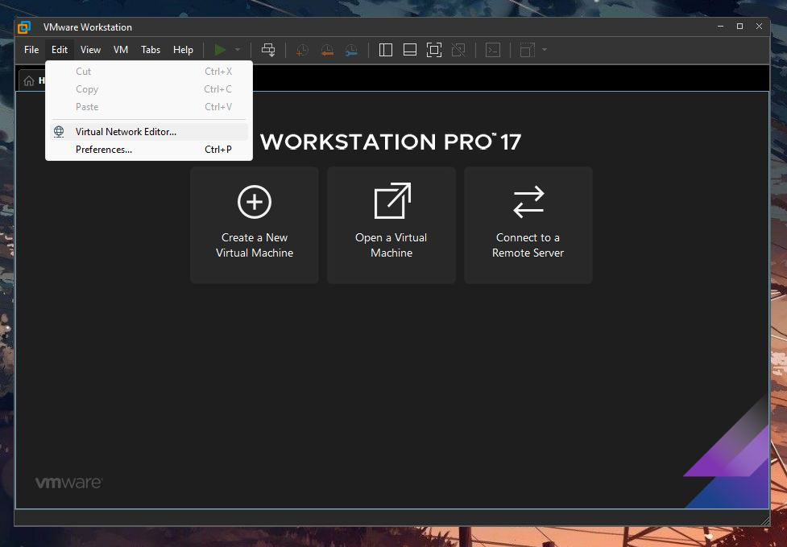

&nbsp;
---
&nbsp;

### 2. Select `Add Network..`

 

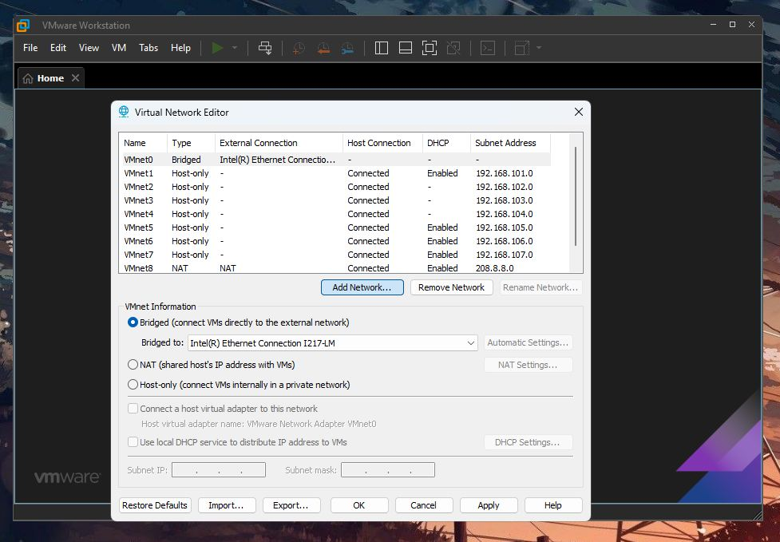

&nbsp;
---
&nbsp;

### 3. Add `VMnet15`

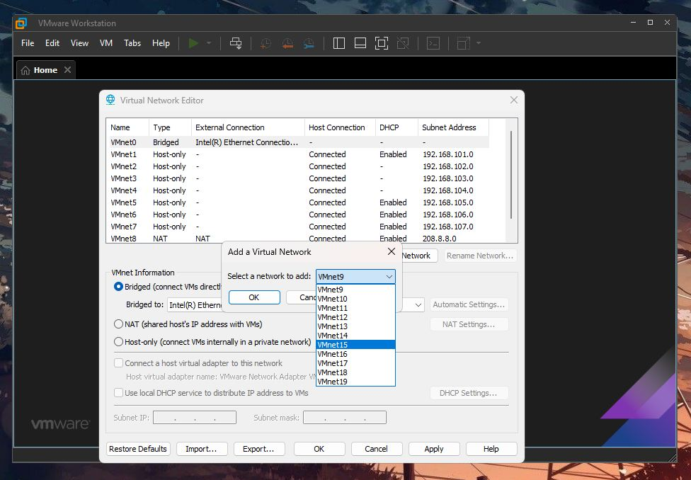

&nbsp;
---
&nbsp;

### 4. Edit VMnet15 with the following settings:
- VMnet Information: __Host-only__
> - [x] Connect a host virtual adapter to this network
> - [x] Use local __DHCP service__ to distribute IP address to VMs
- Subnet IP: 10.255.10.0
- Subnet Mask: 255.255.255.0

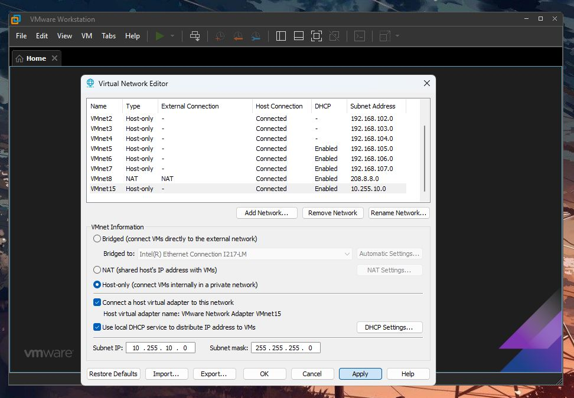

&nbsp;
---
&nbsp;

### 5. Now `Add Network..` again

&nbsp;
---
&nbsp;

### 6. Add `VMnet16`

&nbsp;
---
&nbsp;

### 7. Edit VMnet16 with the following settings:
- VMnet Information: __Host-only__
> - [x] Connect a host virtual adapter to this network
> - [x] Use local __DHCP service__ to distribute IP address to VMs
- Subnet IP: 10.69.255.0
- Subnet Mask: 255.255.255.248

&nbsp;
---
&nbsp;

### 8. Extract the `RSTHayup` 7zip file
> [!NOTE]
> The filename may be different.

 

&nbsp;
---
&nbsp;

### 9. Inside the RSTHayup directory, open the `.vmx` file.

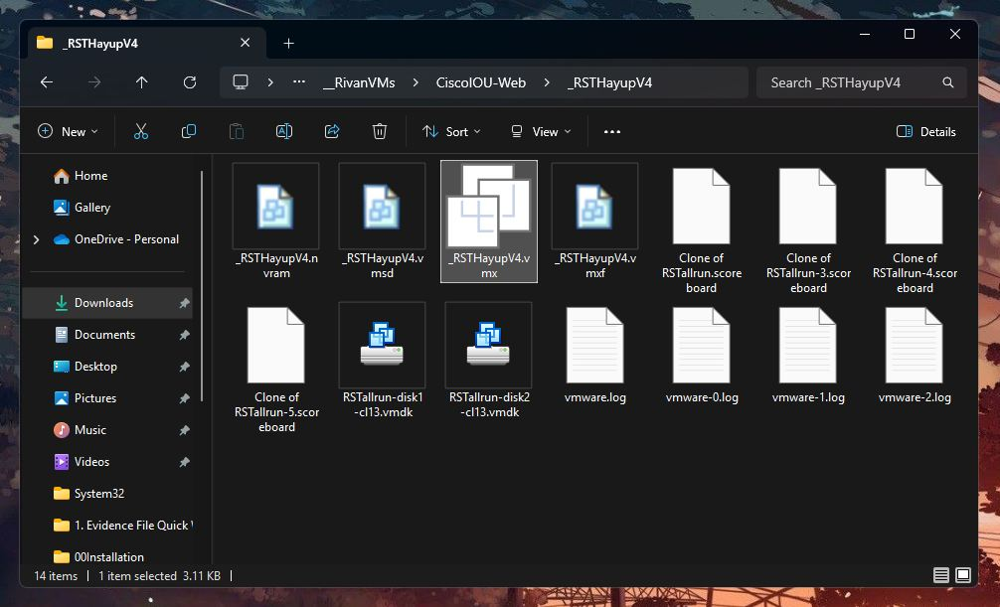

&nbsp;
---
&nbsp;

### 10. Power on the Virtual Machine
> [!NOTE]
> If you do not create VMNets 15 & 16, RSTHayup VM will take a while in obtaining IP address for its ethernet interfaces.

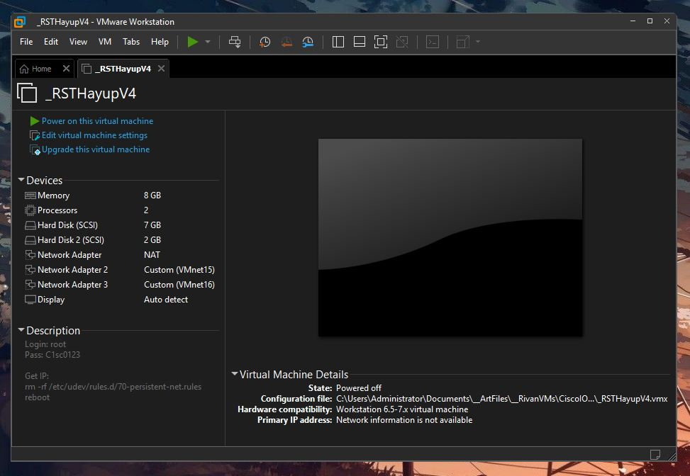

&nbsp;
---
&nbsp;

### 11. Select `I copied it`

 

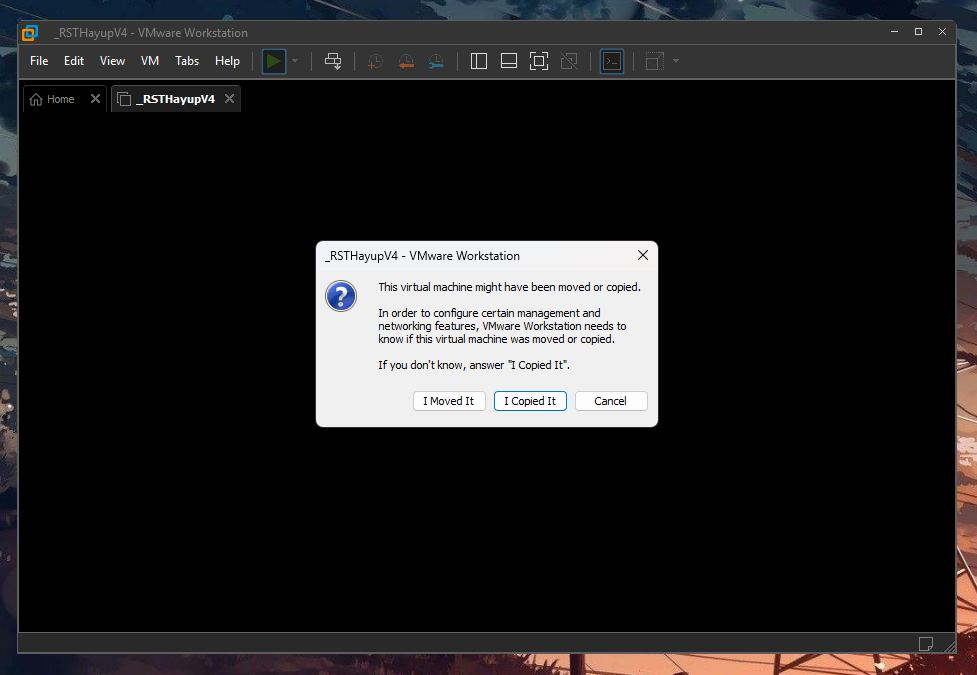

&nbsp;
---
&nbsp;

### 12. Login to the VM
- Username: root  
- Password: C1sc0123  

&nbsp;
---
&nbsp;

### 13. Delete the Firewall
Enter the following command:
~~~
rm -rf /etc/udev/rules.d/70-persistent-net.rules
~~~

Then, 

~~~
reboot
~~~

 

> [!TIP]
> Press `[TAB]` to autocomplete.
> `Example: rm -rf /e[TAB]/u[TAB]/r[TAB]/7[TAB]`

 

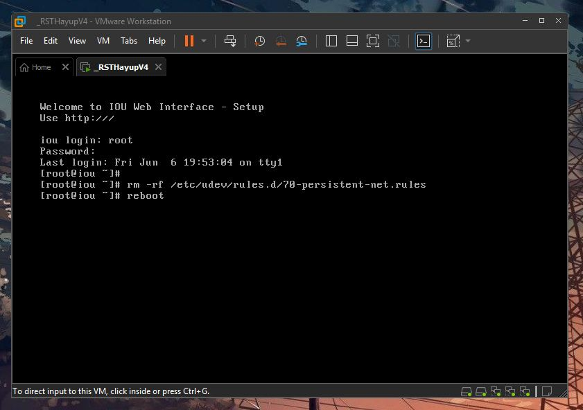

&nbsp;
---
&nbsp;

### 14. Access the GUI
After the VM has rebooted, it will recieve an IP address.  
In this case, it is 208.8.8.129

 

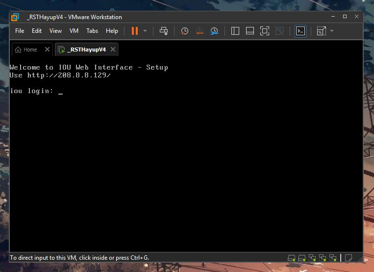

 

Open the IP address on a browser.

&nbsp;
---
&nbsp;

### 15. Select `00 RSTvX: RouteSwitchTshoot Hayup Lab`

 

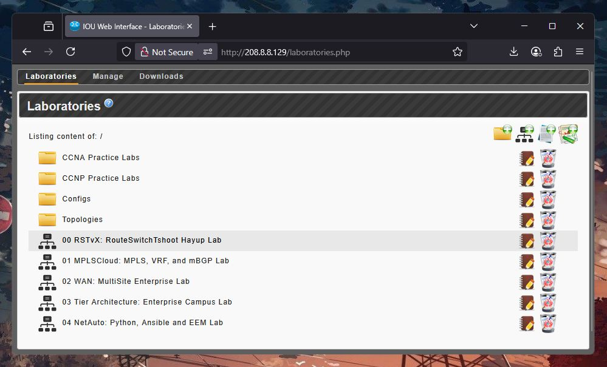

&nbsp;
---
&nbsp;

### 16. The first page will be the topology. To turn on the devices, select the `Devices` tab.

 

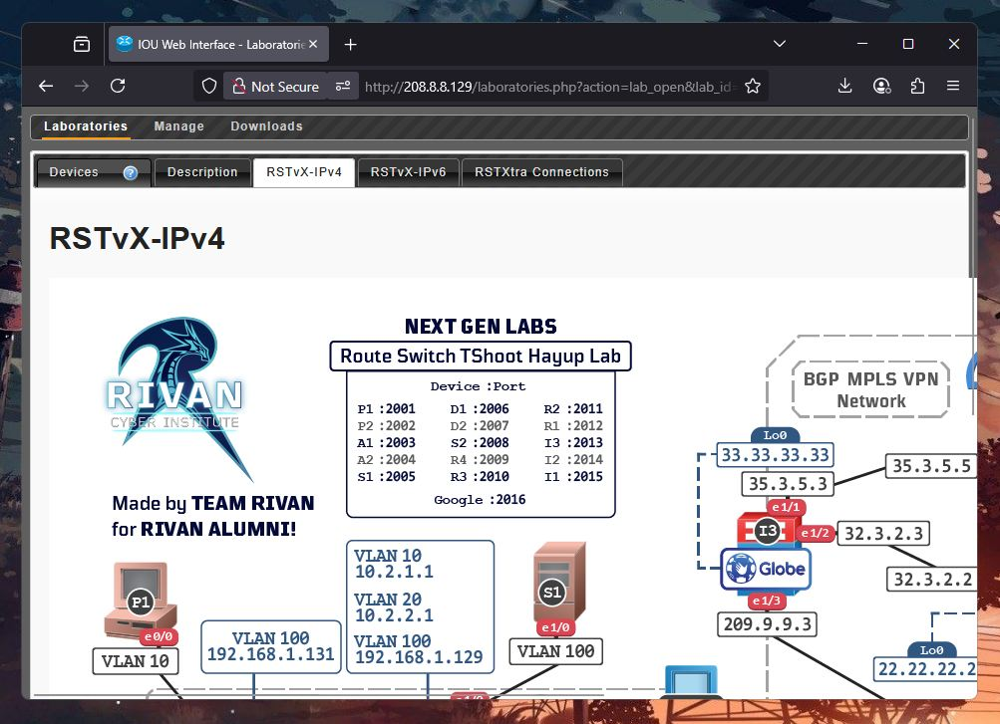

&nbsp;
---
&nbsp;

### 17. Power on all the devices at once.

 

 

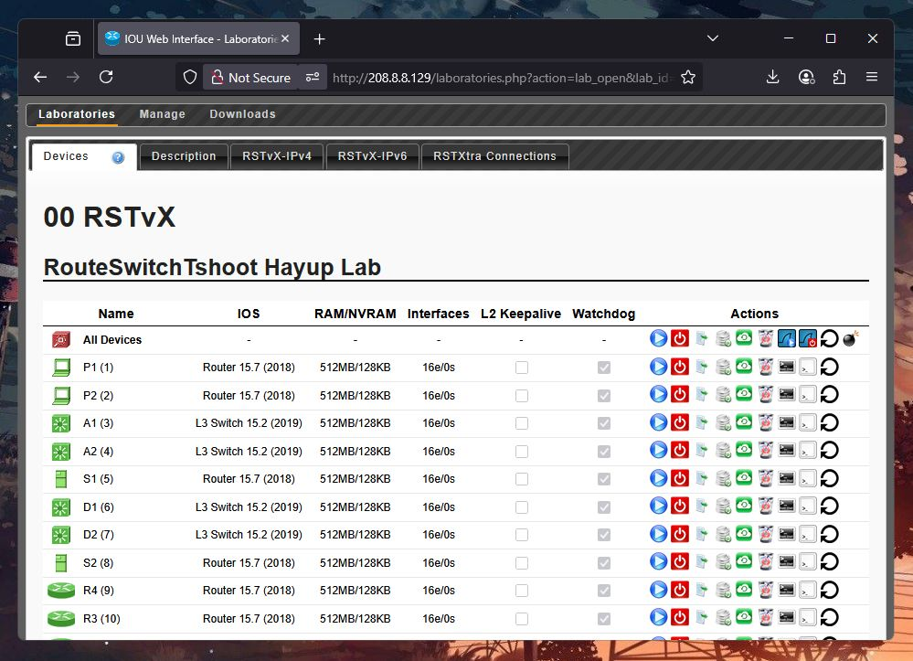

&nbsp;
---
&nbsp;

### 18. 

